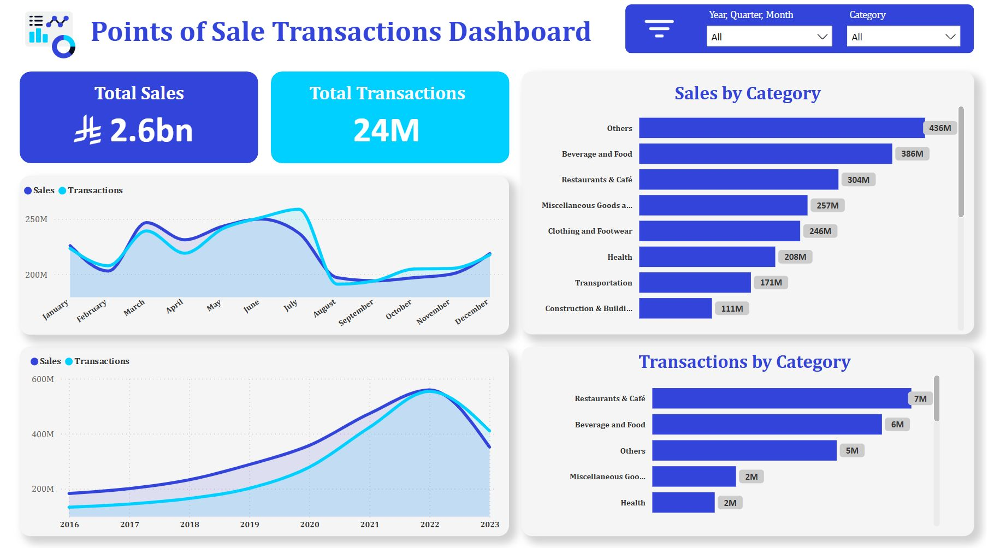

# 💳 POS Transactions Dashboard - Financial Analytics

## 🎯 **Project Overview**

> **💰 Financial Data Jam Competition**  
> Advanced financial analytics dashboard analyzing 24M+ transactions worth 2.6B SAR

---

## 📈 **Key Performance Indicators**

### 💰 **Financial Metrics**
- **💎 Total Revenue:** 2.6 Billion SAR
- **📊 Transaction Volume:** 24+ Million transactions
- **📈 Time Period:** 2016-2023 comprehensive analysis
- **💳 Average Transaction:** 108.33 SAR per transaction

### 🍽️ **Category Performance**
- **🥘 Food & Beverage:** 386M SAR (Top performer)
- **🍽️ Restaurant Transactions:** 7M transactions
- **🛍️ Retail Categories:** Comprehensive sector analysis
- **📊 Market Share:** Detailed category breakdown

### 📅 **Temporal Analysis**
- **📈 Growth Trend:** 2016-2023 revenue progression
- **📊 Seasonal Patterns:** Peak transaction periods
- **💹 Year-over-Year:** Performance comparison
- **🎯 Transaction Frequency:** Daily/monthly patterns

### 🏪 **Merchant Analytics**
- **🏢 Business Categories:** Multi-sector transaction analysis
- **📍 Geographic Distribution:** Location-based performance
- **💳 Payment Methods:** Transaction type breakdown
- **⭐ Performance Ranking:** Top merchant identification

---

## 🛠️ **Technical Implementation**

### 📊 **Tools & Technologies Used:**
- **💳 Microsoft Power BI** - Advanced financial analytics & visualization
- **📈 Microsoft Excel** - Financial modeling & statistical analysis
- **⚡ DAX Calculations** - Revenue calculations & time intelligence
- **🔄 Power Query** - Large dataset processing & ETL operations

### 🎨 **Dashboard Features:**
- **📊 Interactive Financial Charts** - Revenue trends & patterns
- **🔍 Advanced Filtering** - Multi-dimensional transaction analysis
- **📈 Real-time Metrics** - Dynamic KPI tracking
- **💹 Comparative Analytics** - Category & period comparisons

### 📋 **Data Visualization Components:**
- 💰 Revenue trend lines with growth indicators
- 🥧 Category distribution pie charts
- 📊 Monthly transaction volume bars
- 📈 Year-over-year comparison charts
- 🎯 KPI cards with financial highlights

---

## 💼 **Business Impact & Value**

### 🎯 **Strategic Insights:**
- **💳 Payment Optimization** - Transaction method preferences
- **🛍️ Retail Strategy** - Category performance optimization
- **📊 Financial Forecasting** - Revenue trend predictions
- **🏪 Merchant Intelligence** - Business performance insights

### 📚 **Key Findings:**
- **🍽️ F&B Dominance** - Food sector leads with 386M SAR
- **📈 Consistent Growth** - Steady revenue increase 2016-2023
- **💳 Transaction Volume** - 24M+ successful transactions
- **🎯 Market Insights** - Category-wise performance analysis

---

## 🏆 **Project Achievements**

### ✅ **Competition Success:**
- 💰 Financial Data Jam participation
- 📊 Advanced financial analytics demonstration
- 💳 Large-scale transaction data processing
- 📈 Professional financial dashboard development

### 🚀 **Technical Excellence:**
- ⚡ High-performance DAX calculations for 24M+ records
- 🔄 Optimized Power Query for large dataset processing
- 🎨 Intuitive financial dashboard design
- 📊 Real-time financial KPI monitoring

---

## 📋 **Project Details**

**💰 Competition:** Financial Data Jam  
**🏢 Domain:** Financial Analytics & Payment Intelligence  
**🛠️ Tools:** Power BI, Excel, DAX, Power Query  
**📊 Data Volume:** 24M+ transactions, 2.6B SAR  
**✅ Status:** Successfully Completed  

---

> **🚀 This project demonstrates advanced financial analytics capabilities and large-scale data processing skills essential for payment industry insights and retail strategy optimization.**
